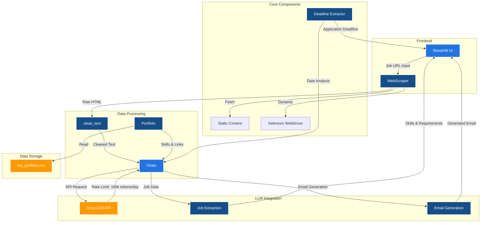

# GenAI Cold Email Generator Architecture

## Component Description

### Frontend
- **Streamlit UI**: Web interface for user interaction and result display
- **WebScraper**: Handles URL fetching with both static and dynamic content support

### Data Processing
- **clean_text**: Text preprocessing and sanitization
- **Portfolio**: Manages skills and project links from CSV data
- **Chain**: Orchestrates the entire workflow

### LLM Integration
- **Groq LLM API**: 
  - Handles natural language processing tasks
  - Rate limit: 100,000 tokens per day
  - Used for job extraction and email generation

### Data Storage
- **my_portfolio.csv**: Stores portfolio data, skills, and relevant links

### Core Components
- **Deadline Extractor**: Specialized component for finding application deadlines
- **Static Content Fetcher**: Basic HTTP requests for simple pages
- **Selenium WebDriver**: Handles JavaScript-heavy pages

## Data Flow
1. User inputs job URL
2. WebScraper fetches and processes the page
3. Text is cleaned and analyzed
4. Job details are extracted using LLM
5. Portfolio data is matched with job requirements
6. Cold email is generated using LLM
7. Results are displayed in UI

## Key Considerations
- Token usage monitoring and optimization
- Graceful handling of rate limits
- Caching opportunities for repeated requests
- Fallback strategies for LLM availability